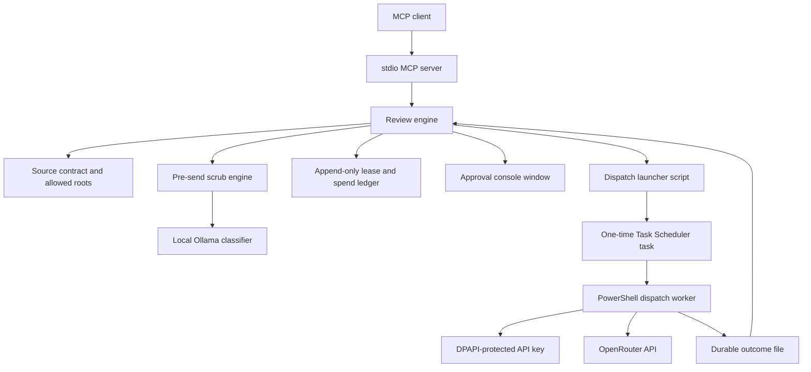

# OpenRouter review MCP

[](https://github.com/johnaadams122/openrouter-review-mcp/actions/workflows/ci.yml)

A Windows-local stdio MCP server that sends a document or diff to a fixed set of cross-vendor AI reviewers (Gemini and Grok models) through the OpenRouter API, and only after three gates: a cost preflight that sends nothing, an explicit authorization step that creates a time-limited spending lease, and a local pre-send scrub of the content.

Every reservation and every charge the server learns of is recorded in an append-only local ledger (see Limitations for the cases where the recorded amount can differ from the real bill), results are stored durably so a client that stopped waiting can recover them, and the API key stays encrypted with Windows DPAPI for the current user. Reviews are advisory: the server reports each reviewer's verdict and findings and changes nothing.

## Architecture



## Setup

Use Windows 11 (CI runs on Windows Server 2022) with Node 24 and Windows PowerShell 5.1 (`powershell.exe`). Live reviews also need an OpenRouter account and API key, Task Scheduler, a signed-in Windows session and a local Ollama instance for the pre-send content check.

```powershell
npm ci --ignore-scripts --no-audit --no-fund
ollama pull qwen2.5:7b
# If scripts are blocked, first allow local scripts (see Optional settings below).
# One time, interactive: stores the API key encrypted with DPAPI for the current Windows user.
powershell.exe -NoProfile -File ./tools/openrouter-review-configure.ps1
$env:OPENROUTER_REVIEW_MCP_INSTALLATION_HARD_MAXIMUM_USD = '<per-workflow spending ceiling>'
$env:OPENROUTER_REVIEW_MCP_IDENTITY_LIST_PATH = '<full path to a private identity list>'
$env:OPENROUTER_REVIEW_MCP_EXTRA_PROTECTED_TERMS_PATH = 'none'
# Optional manual check only: start the server by hand, then stop it.
npm run mcp:start
```

Create the identity list file before the first start. For normal use, let your MCP client start the server: register `node tools/openrouter-review-mcp-server.mjs` as a stdio server in the client, with these variables in the client's server environment, and do not keep a hand-started copy running at the same time (only one server process can own the ledger). Three settings are mandatory and have no default; the server refuses to start until each is set:

- `OPENROUTER_REVIEW_MCP_INSTALLATION_HARD_MAXIMUM_USD`: the per-workflow spending ceiling in USD. Authorization is refused (`LEASE_CAP_EXCEEDED`) when a preflight's worst-case total is above it.
- `OPENROUTER_REVIEW_MCP_IDENTITY_LIST_PATH`: a plain-text file of names, one per line (lines starting with `#` are ignored), that the scrub engine replaces with placeholders before anything is sent. The server refuses to start if the file is missing or has no entries. Keep it outside the repository.
- `OPENROUTER_REVIEW_MCP_EXTRA_PROTECTED_TERMS_PATH`: either `none`, or the absolute path of a terms file together with `OPENROUTER_REVIEW_MCP_EXTRA_PROTECTED_TERMS_SHA256`, the 64-hex SHA-256 of that file's exact bytes. The scrub engine already blocks a built-in set of generic health words; this file adds your own. It is UTF-8 without a byte-order mark and at most 256 KiB. Blank lines and lines starting with `#` are ignored; the first other line must be exactly `extra-protected-terms-v1`; every later line is `marker <term>` (a term that blocks a line by itself) or `context <term>` (a term that makes a line with a weak generic marker word count as protected). If the file is missing, unreadable, changed since you pinned its hash, oversized, malformed or lists no terms, the server refuses to start rather than start without your terms. Keep it outside the repository.

Optional settings: `OPENROUTER_REVIEW_MCP_ALLOWED_ROOTS` (semicolon-separated folders) enables `source_path` input beneath those folders only; without it, only `source_text` is accepted. `OPENROUTER_REVIEW_MCP_DATA_ROOT` moves the ledger, results and alerts out of the default `%LOCALAPPDATA%\OpenRouterReviewMcp` (the encrypted API key file always stays in that default folder). `OPENROUTER_REVIEW_MCP_OLLAMA_URL` and `OPENROUTER_REVIEW_MCP_OLLAMA_MODEL` select the classifier. `OPENROUTER_REVIEW_MCP_DISPATCH_TIMEOUT_MS`, `OPENROUTER_REVIEW_MCP_PREFLIGHT_TTL_MS` and `OPENROUTER_REVIEW_MCP_DAILY_PAID_JOB_ALLOWANCE` change the limits described under Limitations. The server runs its helper scripts with `powershell.exe -File`, so the PowerShell execution policy must allow local scripts (for example `Set-ExecutionPolicy -Scope CurrentUser RemoteSigned`); files extracted from a downloaded zip may also need unblocking (`Get-ChildItem -Recurse | Unblock-File` in the repository folder).

The `hooks/` folder holds two optional Claude Code `PostToolUse` hooks that remind an agent to request a review after it writes a spec or plan document or completes a task. The server does not need them.

## Synthetic example

Synthetic inline review of a short spec, shown as tool calls and abbreviated results:

```text
openrouter_review_preflight { "source_text": "Example spec: cached entries expire after one hour.", "profile": "consequential_spec_v1" }
  -> preflightId, the profile's reviewers and a worst-case reservation; nothing is sent
openrouter_review_authorize_workflow { "preflightId": "<preflightId>", "maxJobs": 2 }
  -> opens the approval console; after the shown phrase is typed: leaseId and expiresAt
openrouter_review_document { "leaseId": "<leaseId>", "preflightId": "<preflightId>", "source_text": "<same text>" }
  -> waits for the reviewers; state PASSED or HALTED; per reviewer: verdict pass or block, findings and the reconciled cost
openrouter_review_result { "leaseId": "<leaseId>" }
  -> the stored result, for a client that stopped waiting
```

This illustrates the interface; findings depend on the reviewer models.

## Tests

```powershell
npm ci --ignore-scripts --no-audit --no-fund
npm test
```

`npm test` runs `node --test --test-concurrency=4 --test-timeout=180000 --test-reporter=tap tests/*.test.mjs`. CI performs the same locked `npm ci` setup and then runs `node --test --test-concurrency=4 --test-timeout=180000` with every `tests/*.test.mjs` file named explicitly, as declared in `.github/ci/portfolio-tests.json`.

The suite needs Windows: several tests start Windows PowerShell, create NTFS junctions and call the current-user DPAPI API on synthetic data. No test reads a stored credential, opens an approval window, registers a scheduled task or contacts OpenRouter or a real Ollama instance.

The documented suite uses synthetic data and mocks external services. Dependency
installation may use public package registries; tests are reviewed to run offline.
The CI badge reports the hosted workflow's status for its selected commit.

## External services

The OpenRouter API is the only remote service. Reviews are posted to its chat completions endpoint with the user's own API key, and after each review a read-only key-status check reads the key's spending limit to warn when a monthly limit is nearly used. Both calls are made only by the Windows PowerShell scripts in `tools/`. The key is entered once through `tools/openrouter-review-configure.ps1`, stored encrypted with Windows DPAPI for the current user and decrypted only inside those scripts. DPAPI ties the key to your Windows account: other Windows users cannot read it, but any program running as you can.

Each dispatch runs as a one-time Windows Task Scheduler task with an interactive logon and a hidden window, so it survives the MCP server process being restarted; its outcome is written to a file that the server reconciles. Each reviewer call gets a cutoff of 10 minutes by default (`OPENROUTER_REVIEW_MCP_DISPATCH_TIMEOUT_MS` changes this), never later than the authorization's own expiry. The worker sends the request and waits for the reply within that cutoff, but reading a slow reply body can run past it; Task Scheduler stops the worker task roughly 30 minutes after the cutoff (the limit is counted from when the task starts, so a late start moves it later). A preflight stays usable for 30 minutes by default (`OPENROUTER_REVIEW_MCP_PREFLIGHT_TTL_MS`). The profile's reviewers run concurrently, and `openrouter_review_document` waits until they have all finished. If your MCP client stops waiting first (some cut tool calls off after about 60 seconds), the review keeps running and is still billed: do not repeat the call, poll `openrouter_review_result` with the lease id instead.

Authorization opens a visible Windows PowerShell console window where the operator types the shown approval phrase. An operator can set `OPENROUTER_REVIEW_MCP_AUTONOMOUS_AUTHORIZATION=1` (exactly `1`; any other value leaves the prompt in place) to skip that prompt for the first authorization of each document. A repeat for the same document then needs a stated justification, and the ledger decides what happens: if it shows that the previous review of that document failed, any justification is accepted without the prompt or the judge; if it shows that the previous review succeeded, only a human justification is accepted and it opens the prompt; otherwise a human justification opens the prompt and a model justification is checked by the local model judge.

A local Ollama instance (default `http://localhost:11434`, model `qwen2.5:7b`) answers the pre-send content checks and, when autonomy is on, the repeat-authorization judge. When it is unreachable, the content is blocked instead of sent. Alerts are appended to a local JSON-lines file, `alerts.jsonl`, in the data root; nothing is pushed elsewhere. They cover autonomous grants, a warning when the key's monthly limit is 75 percent used, a critical alert after 3 consecutive dispatch failures (`OPENROUTER_REVIEW_MCP_CONSECUTIVE_DISPATCH_FAILURE_ALERT_THRESHOLD` changes the count), and a critical alert when a reviewer was billed above its reserved worst case. The test suite replaces all of these services with local fakes.

This release contains the per-session server only. The repository also holds the tool definitions and library code for a second, shared mode in which one local service handles reviews for several clients and a long review returns a pending receipt instead of blocking. The bridge, service and installer that provide that mode are not part of this release, so the shared-mode tools are not registered by the server as shipped.

## Limitations

Windows only. The approval prompt, dispatch launcher and worker, and key-status check are Windows PowerShell 5.1 scripts; the API key is protected with DPAPI for the current Windows user; dispatch needs Task Scheduler and a signed-in session. There is no Linux or macOS runtime.

Reviews are report-only. The server returns each reviewer's verdict and findings; it does not block, merge or change anything, and reviewer output can be wrong.

The supported profiles are `consequential_spec_v1`, `plan_review_v1`, `impl_review_v1`, `code_rescue_v1` (Gemini and Grok) and `final_verification_v1` (Grok, plus Gemini for some change kinds). Other profile ids that remain in the registry belong to a retired free-tier experiment and are not supported: unlike the supported profiles, their requests do not ask for zero-data-retention routing and allow provider data collection, so do not send anything through them.

Costs depend on the user's OpenRouter account, the chosen profile and the provider's current prices. The operator-set per-workflow ceiling, a daily allowance of paid reviewer calls (each reviewer in a review counts as one call; default 20 per UTC day, `OPENROUTER_REVIEW_MCP_DAILY_PAID_JOB_ALLOWANCE`), lease expiry and worst-case reservations bound what the server will attempt, but OpenRouter bills the account. The Grok model can bill reasoning tokens beyond its requested output limit, so its worst-case reservation is sized from the model's whole 500,000-token context window; set the ceiling above the reservation a preflight reports. When a dispatch outcome cannot be confirmed, or a reply arrived but could not be read, the local ledger books the full reservation, which can differ from the real charge. A dispatch that times out or loses its connection before any reply arrives is booked at zero cost; OpenRouter normally cancels such a request, but it can still bill the prompt (and any output already produced), so the ledger can under-record those charges.

The scrub engine replaces names from your identity list, currency amounts and account-number-like digit runs with placeholders, and blocks a line that matches its other patterns, that the local classifier flags, or that still contains a listed name after replacement; it cannot guarantee that every sensitive detail is found. Requests made through the supported profiles ask OpenRouter for zero-data-retention routing with provider data collection denied.

Only one server process at a time can own the local ledger for authorization and dispatch. Other connected sessions wait for it, bounded by `OPENROUTER_REVIEW_MCP_ARM_TIMEOUT_MS` (90 seconds by default), and then receive a structured error; preflight, status and result keep working meanwhile. The ledger is one JSON file per record and nothing in this repository removes or compacts those files. A dispatch the launcher stops waiting for can leave its one-time scheduled task registered. These tasks are named `OpenRouterReviewDispatch-<job id>`; remove leftovers by hand, for example with `Unregister-ScheduledTask`.

A reviewer reply is read fully into memory before its 16 MiB size limit is checked. The offline tests use fakes and do not prove live provider behavior. The software is provided as is, without warranty, under the MIT License.

## How this was built

The project owner designed the architecture, wrote specifications, directed AI coding agents,
and used AI reviewers plus his own review of designs, plans and results. The code
was developed with AI assistance and review gates.

## License and security

MIT. See [LICENSE](LICENSE) and [SECURITY.md](SECURITY.md).
